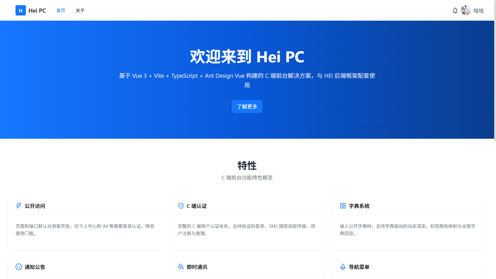
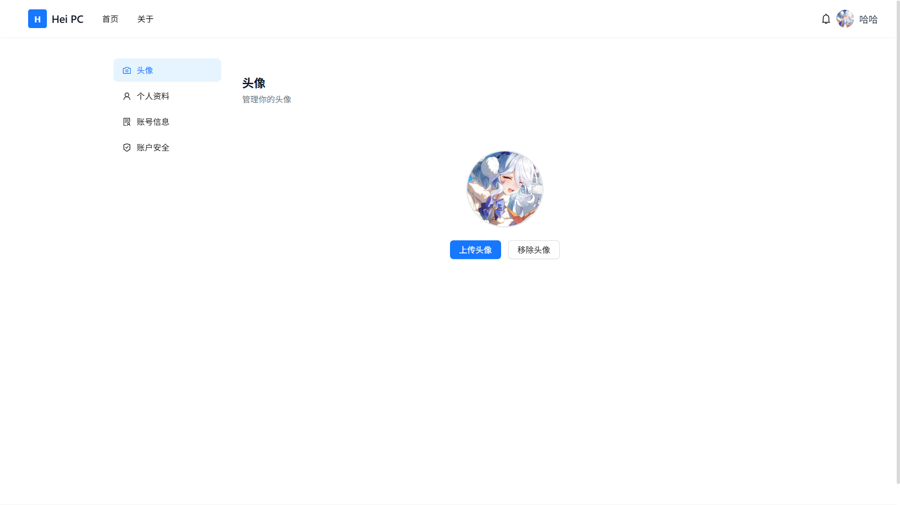

# Hei PC Vue

**Hei PC Vue** 是 HEI 快速开发框架的 Vue3 前台（C 端）解决方案，基于 Vue 3 + Vite + TypeScript + Ant Design Vue 构建，面向公众用户。


## 简介

Hei PC Vue 与 [Hei Gin](https://github.com/jiangbyte/hei-gin) 后端配套使用，作为前台（C 端）展示与交互界面。与 [Hei Admin Vue](https://github.com/jiangbyte/hei-admin-vue)（后台管理）不同，本项目面向公众用户，页面默认对游客开放，支持按需接入 C 端用户认证体系。

**主要特点：**
- **公开访问策略** — 页面和接口默认对游客开放，仅个人中心、IM 等需要登录
- **导航菜单模式** — 支持 `static`（纯前端静态）、`backend`（后端获取）、`merge`（静态+后端合并）三种模式
- **C 端用户体系** — 可选用户登录/注册（验证码 + SM2 国密加密）
- **IM 即时通讯** — WebSocket 实时消息，支持好友、群聊、会话管理
- **字典** — 接入公开字典树，支持字典驱动的动态渲染
- **通知公告** — 公共公告列表与详情，支持首页最新公告展示
- **文件上传** — C 端文件上传，支持图片预览
- **共享技术栈** — 与 Admin 一致的 HTTP 封装、状态管理、字典工具链

## 预览





## 技术栈

| 类型 | 技术 |
|------|------|
| 核心框架 | Vue 3.5+、Vite 8.x、TypeScript 5.x |
| UI 组件 | Ant Design Vue 4.x、@ant-design/icons-vue |
| 状态管理 | Pinia（pinia-plugin-persistedstate 持久化） |
| 路由 | Vue Router 4.x |
| HTTP 请求 | Alova 3.x（Fetch / XHR 双适配器） |
| 样式方案 | UnoCSS + Sass |
| WebSocket | 原生 WebSocket（指数退避重连，最多 10 次） |
| 工具库 | @vueuse/core、Day.js |
| 加密 | sm-crypto（国密 SM2/SM3/SM4） |

## 功能模块

| 模块 | 说明 | 是否需要登录 |
|------|------|------------|
| 首页 | 公开首页，展示横幅、公告、配置 | 否 |
| 关于 | 关于页面 | 否 |
| 通知公告 | 公告列表与详情 | 否 |
| 登录 | C 端用户名密码登录（验证码 + SM2 加密） | 否 |
| 注册 | C 端用户注册 | 否 |
| 个人中心 | 个人信息查看、头像修改、密码修改 | 是 |
| 即时通讯 | WebSocket 实时聊天，支持好友/群聊/会话 | 是 |
| 文件上传 | C 端文件上传（支持 XHR 进度） | 是 |

## 项目结构

```
hei-pc-vue/
├── public/                      # 静态资源
├── dist/                        # 构建产物
├── src/
│   ├── api/                     # API 接口层（Alova）
│   │   ├── auth/index.ts        # 认证接口（登录/注册/验证码/SM2 公钥）
│   │   ├── client/user/index.ts # C 端用户接口（个人信息/头像/密码）
│   │   ├── home/index.ts        # 首页数据
│   │   ├── im/
│   │   │   ├── broadcast.ts     # 广播消息
│   │   │   ├── file.ts          # IM 文件
│   │   │   ├── friend.ts        # 好友管理（请求/黑名单/搜索）
│   │   │   ├── group.ts         # 群组管理（CRUD/成员/入群申请）
│   │   │   └── message.ts       # 消息/会话管理
│   │   └── sys/
│   │       ├── banner/index.ts  # 横幅展示
│   │       ├── config/index.ts  # 配置查询
│   │       ├── dict/index.ts    # 字典树（公开）
│   │       ├── file/index.ts    # 文件上传
│   │       └── notice/index.ts  # 公告列表/详情
│   ├── components/              # 公共组件
│   │   └── DictSelect.vue       # 字典选择组件
│   ├── config/
│   │   └── nav.ts               # 导航菜单配置（静态项 + 获取函数）
│   ├── hooks/                   # 自定义 Hooks
│   │   ├── useMobile.ts         # 移动端适配
│   │   ├── useNavMenu.ts        # 导航菜单管理（三种模式）
│   │   └── useWs.ts             # WebSocket 连接/心跳/重连
│   ├── layouts/                 # 布局组件
│   │   ├── base-layout/         # 基础布局（公共 Header + Footer）
│   │   └── blank-layout/        # 空白布局（登录/注册页）
│   ├── router/                  # 路由配置
│   │   ├── index.ts             # 路由实例（首页/关于/公告/IM/个人中心）
│   │   ├── routes.ts            # 静态路由（登录/注册/403/404）
│   │   └── guard.ts             # 路由守卫（requiresAuth 检查）
│   ├── store/                   # 状态管理（Pinia）
│   │   ├── index.ts             # Store 导出
│   │   ├── app.ts               # 应用状态（加载/主题/灰/弱色模式）
│   │   ├── auth.ts              # 认证状态（Token/用户信息/SM2 公钥）
│   │   ├── dict.ts              # 字典缓存（懒加载）
│   │   └── ws.ts                # WebSocket 状态（连接/消息/未读数）
│   ├── styles/                  # 全局样式
│   ├── types/                   # TypeScript 类型定义
│   ├── utils/                   # 工具函数
│   │   ├── http/                # Alova 实例封装（请求/响应拦截、令牌刷新）
│   │   ├── confirm.ts           # 确认对话框
│   │   ├── dictTool.ts          # 字典工具（标签/颜色/选项列表）
│   │   ├── download.ts          # 文件下载
│   │   ├── iconUtil.ts          # 图标工具
│   │   └── index.ts             # 工具函数导出
│   ├── views/                   # 页面组件
│   │   ├── auth/                # 登录/注册
│   │   ├── about/               # 关于
│   │   ├── error/               # 403/404
│   │   ├── home/                # 首页
│   │   ├── im/                  # 即时通讯（会话/聊天/群组）
│   │   ├── notice/              # 通知公告
│   │   └── profile/             # 个人中心
│   ├── App.vue                  # 根组件
│   └── main.ts                  # 入口文件（全局字典工具注册）
├── package.json                 # 项目配置
├── vite.config.ts               # Vite 配置
├── tsconfig.json                # TypeScript 配置
├── uno.config.ts                # UnoCSS 配置
├── eslint.config.js             # ESLint 配置
└── .env                         # 环境变量配置
```

## 环境变量

| 变量 | 默认值 | 说明 |
|------|--------|------|
| `VITE_API_BASE_URL` | `http://localhost:18886` | 后端 API 地址 |
| `VITE_APP_NAME` | `Hei PC` | 应用名称 |
| `VITE_DEVICE_ID` | `WEB_PC` | 设备标识 |
| `VITE_NAV_MODE` | `static` | 导航菜单模式（static / backend / merge） |

### 导航菜单模式说明

通过 `VITE_NAV_MODE` 控制导航菜单的数据来源（`src/config/nav.ts` + `src/hooks/useNavMenu.ts`）：

| 模式 | 行为 | 适用场景 |
|------|------|---------|
| `static` | 纯前端静态导航（`src/config/nav.ts` 中定义） | 页面固定，无需后端参与 |
| `backend` | 从后端获取导航数据（替换 `fetchNavItems` 实现），后端不可用时降级到静态 | 导航由 CMS 动态管理 |
| `merge` | 静态为基础，后端数据覆盖同路径项或追加新项 | 静态为基础 + 后端扩展 |

## 快速开始

### 前置要求

- Node.js >= 20
- pnpm >= 9
- 后端服务已启动（[Hei Gin](https://github.com/jiangbyte/hei-gin) 或兼容后端）

### 启动开发

```bash
# 安装依赖
pnpm install

# 配置环境变量（编辑 .env 文件）
# VITE_API_BASE_URL=http://localhost:18886
# VITE_NAV_MODE=static

# 启动开发服务（默认 http://localhost:3100）
pnpm dev

# 构建生产包
pnpm build

# 预览构建结果
pnpm preview
```

> 开发时需确保后端服务已启动，`.env` 中的 `VITE_API_BASE_URL` 需指向后端地址（默认 `http://localhost:18886`）。

## 路由权限

路由通过 `meta.requiresAuth` 标记是否需要登录：

```typescript
// src/router/index.ts
{
  path: 'profile',
  component: () => import('@/views/profile/index.vue'),
  meta: { title: '个人中心', requiresAuth: true },
}
```

路由守卫（`src/router/guard.ts`）自动检查：
- 未登录访问需认证页面 → 跳转登录页（携带 `redirect` 参数）
- 根路径 `/` 根据登录状态自动分流
- 动态路由初始化时处理 404 重试

## 字典系统

字典通过 `src/store/dict.ts` 的 `useDictStore` 管理，采用懒加载策略：

```typescript
// 在需要使用字典的页面中
const dictStore = useDictStore()
await dictStore.loadDict()
```

数据源为 `GET /api/v1/sys/dict/tree`（与 Admin 共用同一个字典树接口）。支持通过 `getDictItems`、`dictLabel`、`dictColor` 等方法进行字典回显。

全局注册后可在模板中直接使用：

```vue
{{ $dict.label('sex', record.sex) }}
{{ $dict.color('status', record.status) }}
```

## WebSocket 即时通讯

**文件**：`src/store/ws.ts`、`src/hooks/useWs.ts`

内置 WebSocket 客户端管理：

- 连接地址：`ws://host/api/v1/c/im/ws?token={token}`
- 心跳：每 30 秒发送 `{ type: "heartbeat" }`
- 重连：指数退避（2^n 秒，最长 30 秒），最多 10 次
- 消息事件驱动：`new_message`、`group_message` 触发版本号递增
- 未读计数：`useWsStore().unreadCount` 响应式更新

## 与 Hei Admin Vue 的关系

共享相同的基础技术栈和工具链：

- **HTTP 封装**: 相同的 Alova 实例配置、响应拦截、错误处理
- **字典工具**: 相同的 dictStore + dictTool 模式
- **字典组件**: 可复用的 `DictSelect` 组件
- **状态管理**: 相同的 Pinia + persist 持久化方案

区别在于：
- **Hei Admin Vue** 需要登录后通过动态路由加载菜单和权限，面向后台管理员
- **Hei PC Vue** 默认公开访问，认证为可选功能，面向公众用户

## 相关项目

| 项目 | 说明 |
|------|------|
| [Hei Gin](https://github.com/jiangbyte/hei-gin) | Go 后端（Gin + GORM） |
| [Hei Admin Vue](https://github.com/jiangbyte/hei-admin-vue) | 管理后台前端（Vue 3） |
| [Hei Boot](https://github.com/jiangbyte/hei-boot) | Java 单体应用（Spring Boot） |
| [Hei FastAPI](https://github.com/jiangbyte/hei-fastapi) | Python 后端（FastAPI） |

## 参与贡献

欢迎贡献代码或提出建议！

1. Fork 本仓库
2. 新建 `Feat_xxx` 分支
3. 提交代码
4. 创建 Pull Request

## 开源协议

本项目采用 [MIT License](LICENSE) 开源协议

## 联系方式

- [GitHub](https://github.com/jiangbyte/hei-pc-vue)

---

如果这个项目对你有帮助，请给一个 Star 支持！
